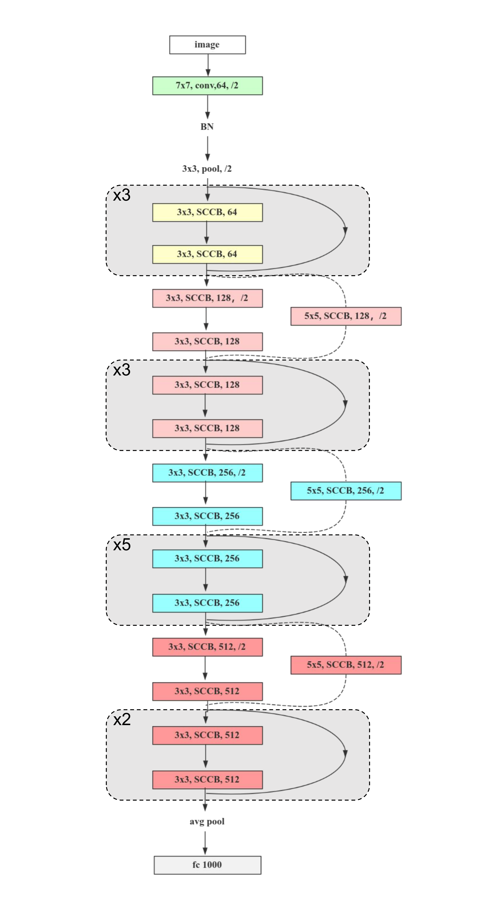

# Subspace Combination Convolutional Network For Image Classification

This repository contains PyTorch implementation for SCCNet .

## Introducing

While convolutional neural networks (CNNs) dominate real-time vision systems, their foundational limitations persist: linear convolution operations restrict nonlinear feature modeling, and static receptive fields hinder adaptation to spatially varying visual patterns. To fundamentally address these constraints, we propose ​​Subspace Combination Convolution (SCC)​​ – an innovative operator that intrinsically embeds adaptive nonlinear transformations and dynamic receptive field scaling within the convolution process.

Departing from activation-dependent nonlinearity approaches, SCC revolutionizes feature representation through dual synergistic mechanisms:

​​Spatially Specialized Kernel Partitioning​​: Convolutional kernels are decomposed into task-optimized subspaces for localized feature computation.
​​Feature-Guided Dynamic Recombination​​: Subspaces are adaptively recomposed under the guidance of local feature maxima.
This architecture delivers two breakthrough capabilities:
✓ ​​Activation-Free Nonlinearity​​: Achieves nonlinear transformations without separate activation layers, eliminating distribution shift inherent in traditional convolution-activation blocks.
✓ ​​Continuous Receptive Field Adaptation​​: Enables fluid receptive field scaling through weight subspace recombination, overcoming interpolation artifacts in deformable convolutions and fixed-size constraints of standard convolutions.

Empirical validation across ImageNet-1k, CIFAR-10, and CIFAR-100 benchmarks demonstrates significant accuracy improvements, confirming SCC's superiority in modeling complex visual patterns while maintaining hardware efficiency.




## Subspace Combination Convolution

The SCC operator dynamically adjusts the number of convolutional kernel samples to flexibly capture subspaces with varying receptive fields. Each subspace is then subjected to distinct affine transformations. Our implementation is readily implementable and delivers superior training performance.​

```python
import torch
import torch.nn as nn
import torch.nn.functional as F


class Conv2d(nn.Module):
    def __init__(self, in_channels, out_channels, stride=1, kernel_size = 3, dilation=1, groups=1, mask_prob=0.005):
        super(Conv2d, self).__init__()
        self.in_channel = in_channels
        self.rge = kernel_size//2
        self.stride = stride
        self.dilation = dilation
        self.groups = groups
        self.mask_prob = mask_prob
        self.weight = nn.Parameter(torch.Tensor(out_channels,in_channels,kernel_size,kernel_size))
        self.bias = nn.Parameter(torch.Tensor(self.rge+1, out_channels))
        self.alpha = nn.Parameter(torch.Tensor(self.rge+1, out_channels,1,1))
        self.beta = nn.Parameter(torch.Tensor(self.rge+1, out_channels,1,1))
        self.tanh = nn.Tanh()
        nn.init.uniform_(self.weight, a=-0.2, b=0.2)
        nn.init.uniform_(self.bias, a=-2.0, b=2.0)
        nn.init.uniform_(self.alpha, a=-2.0, b=2.0)
        nn.init.uniform_(self.beta, a=-2.0, b=2.0)

    def charge_val(self, old, new, output, alpha, beta, lock):
        cmp_val = new > old
        if self.training:
            select = (torch.rand_like(old) + self.mask_prob).floor_() == 1.0
            cmp_val = ((cmp_val) | select) & ~lock
            lock = lock | select
        return torch.where(cmp_val , new, old), torch.where(cmp_val, new*(1+self.tanh(alpha))+beta, output), lock

    def forward(self, x):
        weight = self.weight
        bias = self.bias
        scc = F.conv2d(x, weight[:, :, self.rge:self.rge + 1, self.rge:self.rge + 1],
                               bias[0], self.stride, 0, 1, self.groups)
        output = scc*(1+self.tanh(self.alpha[0]))+self.beta[0]
        lock = (torch.rand_like(output) + self.mask_prob).floor_() == 1.0
        for i in range(1,self.rge+1):
            new_scc = F.conv2d(x, weight[:, :, self.rge - i:self.rge + i + 1, self.rge - i:self.rge + i + 1],
                               bias[i], self.stride, i*self.dilation, self.dilation, self.groups)
            scc, output, lock = self.charge_val(scc, new_scc, output, self.alpha[i], self.beta[i], lock)
        return output

```

# Model Comparison on ImageNet-1K

**SCCNet34 vs. ResNet34 Variants**

| Model             | Downsample  | Params   | GFlops (Theo) | Top-1 (%) | Top-5 (%) |
|-------------------|-------------|----------|---------------|-----------|-----------|
| **ResNet34**      |             |          |               |           |           |
|                   | Conv1x1     | 21.79 M  | 3.68          | 73.74     | 91.80     |
|                   | Conv3x3     | 23.17 M  | 3.84          | 73.78     | 91.74     |
|                   | Conv5x5     | 25.93 M  | 4.15          | 73.81     | 91.69     |
| ResNet34+Mish     | Conv1x1     | 21.79 M  | 3.68          | 74.18     | 91.67     |
| **SCCNet34**      |             |          |               |           |           |
|                   | Conv1x1     | 21.84 M  | 4.07 (3.68)   | 74.08 (+0.34) | 91.83 (+0.03) |
|                   | Conv5x5     | 25.98 M  | 4.07 (4.15)   | 74.13 (+0.39) | 91.71 (-0.09) |
|                   | SCC 3x3     | 23.22 M  | 4.25 (3.84)   | 74.31 (+0.57) | 91.75 (-0.05) |
|                   | SCC 5x5     | 25.98 M  | 4.73 (4.15)   | 74.85 (+1.11) | 92.06 (+0.26) |

**Key Observations**:
-GFlops values (baseline values in parentheses, actual SCCNet values outside parentheses)
-The +/- in Top-1/Top-5 accuracy indicates gains relative to the original ResNet34 Conv1x1 baseline
-The SCC 5x5 configuration achieved a significant improvement of ​​+1.11%​​ in Top-1 accuracy


## Usage

### Requirements

- torch
- torchvision
- setuptools<=70.0
- tensorboard
- six
- tqdm
- matplotlib


**Data preparation**: download and extract ImageNet1K images from http://image-net.org/. The directory structure should be

```
│ILSVRC2012/
├──train/
│  ├── n01440764
│  │   ├── n01440764_10026.JPEG
│  │   ├── n01440764_10027.JPEG
│  │   ├── ......
│  ├── ......
├──val/
│  ├── n01440764
│  │   ├── ILSVRC2012_val_00000293.JPEG
│  │   ├── ILSVRC2012_val_00002138.JPEG
│  │   ├── ......
│  ├── ......
```


### Training

To train SCCNet models on ImageNet from scratch, run:

```
python train.py --data-path /path/to/ILSVRC2012/
```

To finetune a pre-trained model, run:

```
python train.py --data-path /path/to/ILSVRC2012/ --weight checkpoints/flin1kp0.5ds5x-best.pth 
```
